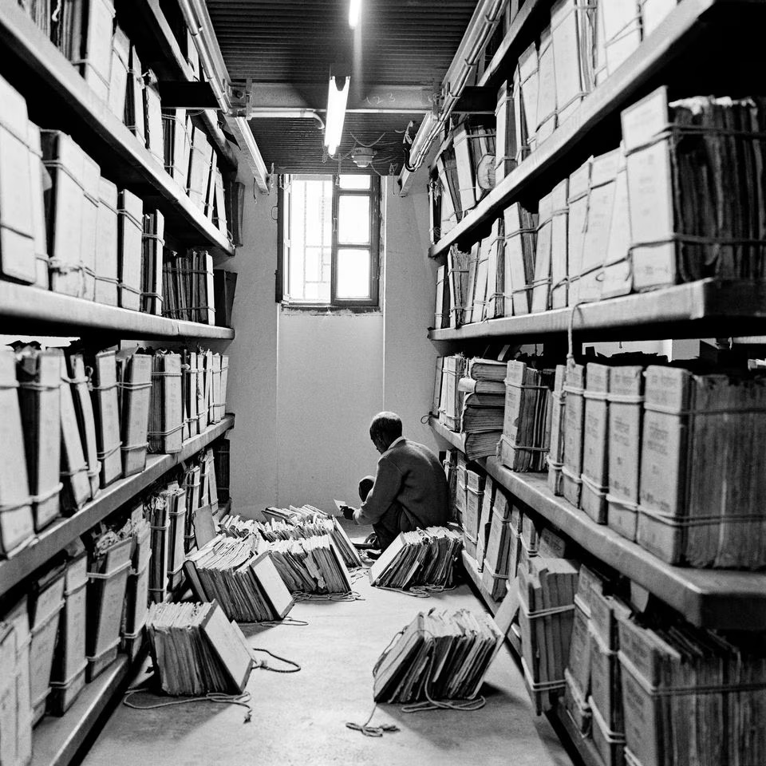

## Mission

    
<figcaption style="font-size: 16px; color: #666; margin-top: 5px;">
        <i> Carp Swimming Against a Waterfall</i>. Utagawa Hiroshige. 
        Image credit: <a href="https://id.rijksmuseum.nl/200134856">Rijksmuseum</a>
    </figcaption>

Our mission is to promote ethical and responsible data practices in the humanities and social sciences (SSH)[^1] by developing a toolkit, including vocabulary, comprehensive guidelines, and resources, for creating datasets that prioritise transparency, inclusivity and respect for diverse perspectives and experiences. 

We believe this research is relevant and necessary, as epistemic systems and data creation are deeply intertwined. The increasing use of data in the field of SSH has allowed for more diversity in approaches to research questions, as well as broadened the possible range of questions that can be asked. However, historical data used in SSH research is by nature overwhelmed by biases, impacted by the author’s positionality and context, producing problematic language and categorisations. There is harm in these biases: they can have real impacts on minoritised groups today, through the production of incorrect and/or one-dimensional narratives that further silence and obscure marginalised perspectives. Alongside (research) frameworks that centre around the role of data in the advancement of social justice, such as [data justice](https://guides.lib.berkeley.edu/c.php?g=1353693&p=9993493)[^2], [data feminism](https://data-feminism.mitpress.mit.edu/), [data advocacy](https://da4all.github.io/methodology/) and [CARE](https://www.gida-global.org/care), we hope to add to the critical discourse around responsible creation and use of data to produce knowledge.

<!-- 
<figure>

<figcaption><i> Carp Swimming Against a Waterfall</i>. Utagawa Hiroshige. Image credit: https://id.rijksmuseum.nl/200134856</figcaption>
</figure> -->

## Objectives
In short, the objectives of the Combatting Bias project are threefold: 

1. **Identify biases**: critically reflect on existing datasets and dataset creation processes. This leads to insights into what is – and more importantly, what is not – represented in current datasets. Through this, it becomes clearer how disproportionate representation or opaque documentation impacts consequent (research) conclusions and causes harm.
2. **Reduce harm**: develop a toolkit, including a bias vocabulary and practical guidelines, to aid researchers in identifying, understanding, articulating and reducing harm caused by biases. This ultimately leads to the creation of ethical and sustainable datasets.
3. **Promote bias-aware research**: encourage SSH researchers and practitioners to consider and reduce harmful biases during their research processes, through the active (re)consideration of certain concepts and categories used in SSH datasets (such as gender and ethnicity), as well as their own practices regarding documentation and visualisations. Additionally, strategies that highlight silences and absences in data are encouraged, such as the creation of counter-narratives, and collection or formalisation of data regarding minoritised experiences. 
4. **Build a socially engaged network**: exchange knowledge and experiences with experts from fields within the SSH and beyond. Knowledge is not produced in a vacuum – especially when working on data ethics, it is crucial we work across disciplines and practices. 

## What's the Buzz about Bias?
We take **bias** centrally as a concept to approach more responsible research practices within the SSH, because it is the foundation in which many of the concerns within data ethics are rooted. Data is not neutral – it is _always_ biased – and by analysing this ‘bias’, we can begin to understand the significance and impacts of our data(sources).  By scrutinising the concept of bias itself, therefore, we can use bias as a category of analysis, a lens, to address a whole host of ethical concerns when creating and using data. This attention to bias is so important because it grounds us to a method of research that is rooted in care and respect, which is precisely what is necessary when working with data, as it represents living things that require this care.

Bias is already a widely used term in the context of creating, identifying and analysing data: it has become a real buzzword, especially in recent times with the quick development of AI tools. The [EU AI Act](https://artificialintelligenceact.eu/), for example, mentions ‘bias’ 25 times, but never provides an explanation of what it means exactly, nor what ‘bias correction’ should look like. Once we understand bias (in all its forms), it becomes less daunting to critically engage with it – this is why we believe it’s necessary to dive into the concept of bias. 

For more on our conceptualisation of bias, see [_On Bias_](/bias/onbias). 

## Why Datasets?

Within the broader developments of the increased entanglement between computational tools and SSH research, our framework specifically focuses on the dataset as the unit of analysis. A dataset[^3] is where **data** (content of datasets, whether from archives, digitally-born or sociological interviews), **researchers** (creators of datasets), **users** (audience of datasets) and **computational methods** (trained on datasets) all intersect – it is therefore a necessary and productive area of intervention. 

    
<figcaption style="font-size: 16px; color: #666; margin-top: 5px;">
        Ed van der Elsken, Groningen and Kyoto students trying-out a translating computer at Kyoto University, May 1985. © Ed van der Elsken (<a href="https://id.rijksmuseum.nl/200134856">Rijksmuseum</a>)
    </figcaption>

Datasets are not only areas of ‘risk’ in need of intervention, they are also areas of immense possibility, if created critically and with awareness of bias. Dataset creation is the ‘deconstruction of archival sources’[^4], through which researchers can uncover new insights and gaps in their sources. It is, for example, due to the creation of datasets and their analysis that it becomes clear that a [17-year old woman named Flora](https://doi.org/10.1080/1081602X.2024.2340542) played a key role in the escape of nineteen peoples from slavery - re-inscribing her into the historical narrative, when her name is not barely in sources. 

## Urgent Questions and Urgent Responses
There are several troubles with the concept of bias that make it both urgent and crucial to deal with if we want to advance within data ethics:

1. As referred to previously, **bias does not have a single definition**, nor is it expressed or used in a uniform way. Instead, it usually refers to a host of different yet interrelated concerns, ranging from discriminatory language to opaque documentation. 
2. Due to its nebulousness, an **expression of bias doesn’t exist in isolation** – biases cascade and stack on top of another. Bias from the archives is perpetuated to datasets, which in turn are used to train computational models. 
3. A specific issue to the SSH field is that **biased data cannot simply be replaced with ‘unbiased’ alternatives**. This seems to be a common strategy within the computer sciences, for example, where data is often artificially added to come to an ‘equitable’ or ‘representative’ dataset (though we would also like to question these terms…). When dealing with questions about (human) experience, as is often the case in the SSH, the limited (historical) source data cannot be ‘rewritten’. Moreover, it is often these biases and their significance that is the subject of studies in the SSH, and so it would be unwanted to delete or change these datapoints.

These three concerns are current roadblocks in the data ethics practices of the SSH and lead to the following three fundamental questions for the field: 

1. What do we mean by "bias" in (SSH) research?
2. Where does bias occur in the dataset creation process? 
3. How do we identify, understand, articulate and reduce bias in datasets?

    
    <figcaption style="font-size: 0.9em; color: #666; margin-top: 5px;">
        Dayanita Singh, File Room, 2013. © <a href="https://dayanitasingh.net/file-room/"/>Dayanita Singh</a>
    </figcaption>

We believe it is the responsibility of the dataset creators to critically reflect on the biases of the source data, and to acknowledge, contextualise and inform users about these - taking active measures to lessen the harmful impacts of biases throughout the lifecycle of data (and beyond). Combatting Bias underlines the necessity for responsible and transparent strategies to navigate these biases. Thus, addressing the above questions, the Combatting Bias project will create a framework that consists of the following corresponding components, that will help guide dataset creators and researchers produce responsible research. 

- **Bias Vocabulary**: A comprehensive list of the concepts connected to bias (such as representation, offensive language, FAIR, CARE, silences, etc.) that creates a shared vocabulary for discussing bias across disciplines. 
- **Bias-Aware Data Lifecycle Model**: Showing where and how bias manifests at different research stages, allowing for targeted interventions at critical points. 
- **Guidelines and Toolkit**: Reflective questions at each stage of the dataset lifecycle, illustrative examples, and “good-better-best” recommendations for bias analysis, description, and mitigation.

<table>
<tr>
<td> <b>What do we mean by "bias" in research?</b> </td> <td> <b>Bias Vocabulary</b>   (representation, language, opacity, etc) </td>
</tr>
<tr>
<td> <b>Where does bias occur in the dataset creation process?   How does it compound?</b> </td> <td>  <b>Bias Aware Dataset Lifecycle</b>   (considerations around expressions of bias across lifecycle) </td>
</tr>
<tr>
<td> <b>How do we identify, understand, and reduce bias in datasets?</b> </td> <td> <b>Guidelines and Toolkit</b>
 (good-better-best, resources, considerations)</td>
</tr>
</table>

The above points, specifically the Vocabulary, will be integrated into existing reusable and machine-readable data documentation templates, such as the Data-Envelopes. In addition, we will create templates that encourage data awareness discussion among project teams. Through this, we not only hope to establish an ethical and sustainable framework for future data collection and curation, but also encourage that different, less represented data is collected.

## Network of expertise

<!-- changed logos to vertical alignment -->

   
Combatting Bias is a collaborative project. We are grateful to work closely together with over 15 researchers, practitioners, and domain experts (see <a href="https://combattingbias.huygens.knaw.nl/about/team/partnerprojects" target="_top"><i>Partner Projects</i></a> and <a href="https://combattingbias.huygens.knaw.nl/about/team/advisors/" target="_top"><i>Advisors</i></a>), who shape our work and thinking through insights into their experiences and expertise in cultural heritage, critical archival studies, community (memory) work, natural language processing, and the FAIR principles, among others. The project itself is also embedded in two research institutes: Huygens Institute and the International Institute of Social History (IISH). Read more about our collaboration with partner projects and advisors in our <a href="/about/projectmethodology" target="_top"><i>Project Methodology</i></a>. 

   
   

       

           
       

       

           
       

   

<!-- 

   
Combatting Bias is a collaborative project. We are grateful to work closely together with over 15 researchers, practitioners, and domain experts (see <a href="https://combattingbias.huygens.knaw.nl/team/partners/partnerprojects/" target="_top"><i>Partner Projects</i></a> and <a href="https://combattingbias.huygens.knaw.nl/team/partners/advisors/" target="_top"><i>Advisors</i></a>), who shape our work and thinking through insights into their experiences and expertise in cultural heritage, critical archival studies, community (memory) work, natural language processing, and the FAIR principles, among others. The project itself is also embedded in two research institutes: Huygens Institute and the International Institute of Social History (IISH). Read more about this in our <i>Project Methodology [under construction]</i>. 

   

       
   

   

       
   

 -->

[^1]: Data definition: 'Data is “units of information observed, collected, or created in the course of research” (Erway et al. 2013).' In: Di Cresce, Rachel, and Julia King. “Developing Collaborative Best Practices for Digital Humanities Data Collection: A Case Study.” College & Undergraduate Libraries 24, no. 2–4 (October 2, 2017): 226–37. https://doi.org/10.1080/10691316.2017.1326330.
[^2]: See David Leslie, Michael Katell, Mhairi Aitken, et al. “Advancing Data Justice Research and Practice: An Integrated Literature Review.” SSRN Scholarly Paper No. 4073376. Social Science Research Network, March 22, 2022. https://doi.org/10.2139/ssrn.4073376; Data Justice Lab https://datajusticelab.org/; Global Data Justice https://globaldatajustice.org/. 
[^3]: Dataset definition: 'a collection of data, published or curated by a single agent or identifiable community. The notion of dataset [...] is broad and inclusive, with the intention of accommodating resource types arising from all communities. Data comes in many forms including numbers, text, pixels, imagery, sound and other multi-media, and potentially other types, any of which might be collected into a dataset.' In: W3C Data Catalog Vocabulary (DCAT) - Version 3. https://www.w3.org/TR/vocab-dcat/#introduction
[^4]: Interview with Historische Database Suriname and Caribbean, 2024/25.
