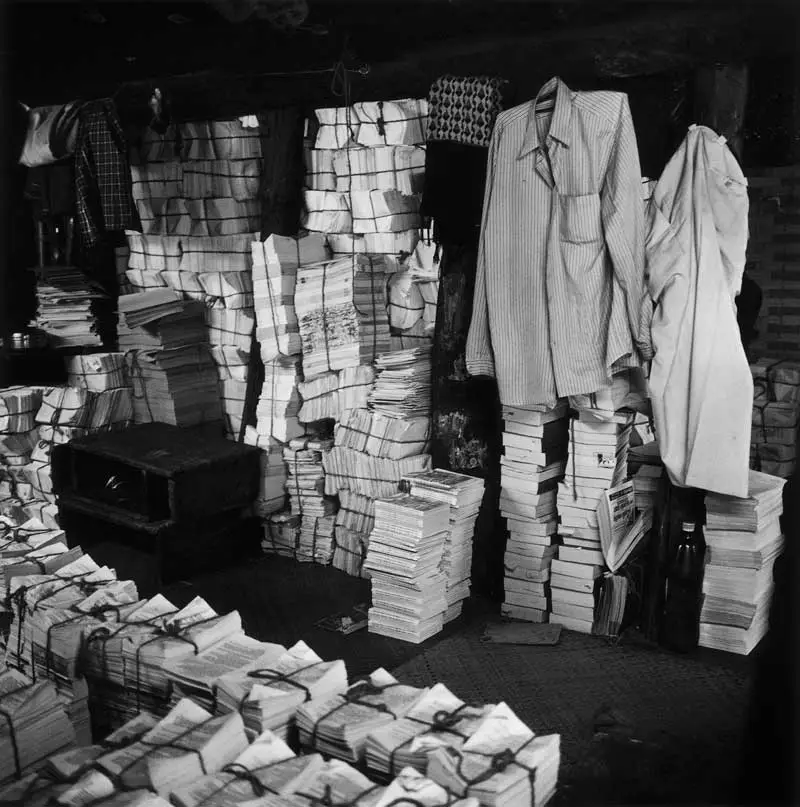

## Project History
The Combatting Bias project grew directly out of [Mrinalini](/about/team/team)’s work at the University of Amsterdam on ["unsilencing" VOC testaments](https://doi.org/10.48550/arXiv.2210.02194) using digital methods and the [Globalise](https://globalise.huygens.knaw.nl/) project – leading to publications on [Data Envelopes](https://aclanthology.org/2024.legal-1.9/) for data contextualisation, centralising [social justice](https://doi.org/10.1515/9783111381831-008) in archival studies, [gender representation](https://aclanthology.org/2024.gitt-1.5/) in multilingual archives, and working with [entity recognition](https://doi.org/10.1108/JD-02-2022-0038) in colonial archives. The research, while dealing with many aspects of bias, did not focus on explaining or mapping these biases. The Combatting Bias is a first step to fill this gap.   

The Combatting Bias project (file number ICT.TDCC.001.001) is a **TDCC-SSH Bottleneck Project**, financed by the Dutch Research Council (NWO) via the [Thematic Digital Competence Centre Social Sciences & Humanities (TDCC-SSH)](https://tdcc.nl/about-tddc/ssh/). 

 

    

        
        
        
    

    
<em> Impressions of conference presentations.   From L-R: AIUCD 2025, DH Benelux 2025, DH Lisbon 2025</em>

## Funding 
- [TDCC-SSH Bottleneck Projects Grant](https://tdcc.nl/tdcc-ssh-bottleneck-projects/), €150.000, 2024-2025

## Publications

**Pre-publications**  

- Mrinalini Luthra and Amber Zijlma. (2025, 7 June). _So Everything is Biased… Now What?!_ DH Benelux 2025, Amsterdam, The Netherlands. https://doi.org/10.5281/zenodo.15614858. 
- Mrinalini Luthra and Amber Zijlma (2025, 2 June). _Everything is biased ... now what?! Introducing the Bias-Aware Framework_. SemDH workshop, Portorož, Slovenia. https://semdh.github.io/accepted-papers#paper20. 
- Mrinalini Luthra and Amber Zijlma. (2025, 12 June). _From Bias Paralysis to Bias as a Category of Analysis. Introducing the Bias-Aware Framework_. Association for Digital Humanities and Digital Culture (AIUCD), Verona, Italy. https://aiucd2025.dlls.univr.it/assets/pdf/papers/85.pdf. 

**Bibliographies**  

- [List of Resources](/resourcesandpublications/resources)

## Events Organised
- Manjusha Kuruppath, Mrinalini Luthra, Lodewijk Petram, Amber Zijlma. (2025, 13 May). [_Combatting Bias Workshop_](https://combattingbias.huygens.knaw.nl/news/mayevents/) [Workshop]. Amsterdam, The Netherlands.
- Manjusha Kuruppath, Mrinalini Luthra, Lodewijk Petram, Amber Zijlma. (2025, 12 May). [_Uncovering Shared Yet Troubled Pasts_](https://combattingbias.huygens.knaw.nl/news/shared-yet-troubled-pasts/) [Panel presentation]. Amsterdam, The Netherlands.
- Manjusha Kuruppath, Mrinalini Luthra, Lodewijk Petram, Amber Zijlma. (2025, 12 May). [_Colonial Archives and Meaningful Digital Infrastructures Symposium_](https://globalise.huygens.knaw.nl/symposium-colonial-archives-and-meaningful-digital-infrastructure/) [Symposium]. Nijmegen, The Netherlands.
- Manjusha Kuruppath, Mrinalini Luthra, Lodewijk Petram, Amber Zijlma. (2025, 8 October). [Combatting Bias Project Kick-Off](https://combattingbias.huygens.knaw.nl/news/kickoff/) [Workshop]. Amsterdam, The Netherlands.

## Conferences and Talks
- Mrinalini Luthra and Amber Zijlma. (2025, 14-18 July). _From Bias Paralysis to Bias as a Category of Analysis_ [Short paper presentation]. [Digital Humanities Conference 2025](https://dh2025.adho.org/), Lisbon, Portugal. 
- Mrinalini Luthra and Amber Zijlma. (2025, 11-13 June). _From Bias Paralysis to Bias as a Category of Analysis. Introducing the Bias-Aware Framework_ [Paper presentation]. [Association for Digital Humanities and Digital Culture (AIUCD)](https://aiucd2025.dlls.univr.it/en-gb/), Verona, Italy. 
- Mrinalini Luthra and Amber Zijlma. (2025, 3-6 June). _So everything is biased … now what?!_ [Workshop]. [Digital Humanities Benelux](https://2025.dhbenelux.org/), Amsterdam, The Netherlands.
- Mrinalini Luthra and Amber Zijlma. (2025, 2 June). _Everything is biased ... now what?! Introducing the Bias-Aware Framework_ [Short paper presentation]. [SemDH Workshop](https://semdh.github.io/), Portorož, Slovenia.
Laura Hollink, Rossana Damiano, Torsten Schrade, Harald Sack, Mrinalini Luthra, and Amber Zijlma. (2025, 2 June). _Cultural Bias_ [Panel discussion]. [SemDH Workshop](https://semdh.github.io/), Portorož, Slovenia.
- Mrinalini Luthra. (2025, 26 March). _So everything is biased … now what?!_ [Presentation]. [Luxembourg Centre for Contemporary and Digital History (C²DH) Hands-on-History Lecture](https://www.uni.lu/c2dh-en/events/so-everything-is-biased-now-what/), Esch-sur-Alzette, Luxembourg.
- Mrinalini Luthra and Amber Zijlma. (2025, 18 March). _Everything is biased… Now what?! Introducing the Combatting Bias Project_ [Presentation]. [COGLOSS x Globalise Webinar](https://www.universiteitleiden.nl/en/events/2025/03/cogloss-march-2025), online. 
- Mrinalini Luthra and Amber Zijlma. (2025, 14 March). _Everything is biased… Now what?! Introducing the Bias-Aware Dataset Lifecycle_ [Presentation]. [Bias in Erfgoedcollecties Sector Event](https://kadoc.kuleuven.be/4_agenda/2025/20250314_face-surface), Leuven, Belgium. 
- Mrinalini Luthra and Amber Zijlma. (2025, 24 January). _What’s the Buzz about Bias? About Bias and the Combatting Bias project_ [Presentation]. [Colonial Archives and Meaningful Digital Infrastructures Symposium](https://globalise.huygens.knaw.nl/symposium-colonial-archives-and-meaningful-digital-infrastructure/), Nijmegen, The Netherlands.

    
    <figcaption style="font-size: 0.9em; color: #666; margin-top: 5px;">
        Dayanita Singh, Go Away Closer, 2007. © <a href="https://dayanitasingh.net/go-away-closer"/>Dayanita Singh</a>
    </figcaption>

