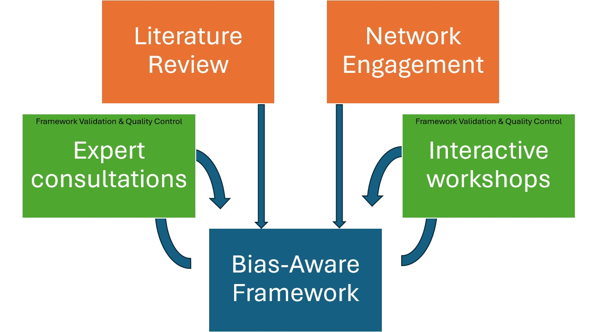

**DOI: [https://doi.org/10.5281/zenodo.17084239](https://doi.org/10.5281/zenodo.17084239){:target="_blank"}**

## Overview

The project methodology for developing the Bias-Aware Framework, consists of a three-part iterative approach, combining theoretical analysis with practical validation: 

1. **Literature Review**: To gain a better overview of current theories about and strategies against bias, we systematically reviewed literature in the fields of archival studies ([Modest and Lelijveld 2018](https://www.materialculture.nl/en/publications/words-matter); [Trouillot 1995](https://books.google.nl/books?id=qNkBDlueIxUC); [Stoler 2010](http://www.jstor.org/stable/j.ctt7rtrg)), epistemology ([Foucault 2002](https://doi.org/10.4324/9780203604168)) and computer sciences ([Gebru et al. 2021](https://doi.org/10.1145/3458723); [Bender and Friedman 2018](https://techpolicylab.uw.edu/data-statements/); [Candela et al. 2023](http://arxiv.org/abs/2304.02603); [Orr and Crawford 2023](https://doi.org/10.31235/osf.io/8c9uh); [Scheuerman et al. 2020](http://hdl.handle.net/11603/19983)). These are fields in which (origins of) bias has received much attention. From here, we expanded out to include sources that were not academic and/or text-based, such as videos, art installations, and fiction. The importance of including these resources was to critically confront our own biases for the written and academic. For each resource, we focused on what forms of bias or strategies to mitigate bias were present, and made a note of that under the column ‘concepts’. We compiled relevant resources in an open-to-access [list of resources](/bias/resourcelist). 
2. **Network Engagement**: The Framework’s development is guided by the insights gleaned from holding semi-structured interviews with [partners](/about/team/partnerprojects) from four major digital infrastructure projects focusing on colonial and slavery archives: [Slave Voyages](https://www.slavevoyages.org/), [Globalise](https://globalise.huygens.knaw.nl/), [Exploring Slave Trade in Asia](https://exploringslavetradeinasia.com/), and the [Historical Database of Suriname and Caribbean](https://www.ru.nl/onderzoek/onderzoeksprojecten/historische-database-van-suriname-en-de-cariben). These partnerships provide crucial contributions to practical challenges and implementation requirements for a toolkit and guidelines. We also conduct conversations with our broad network of [advisors](/about/team/advisors), based in different parts of the world and with expertise from a range of disciplines: cultural heritage, critical archival studies, community (memory) work, natural language processing, and the FAIR principles. As a result, our framework is rooted in plurivocality ([Sitzia 2023](https://doi.org/10.7202/1108037ar)), offering a range of strategies and (precedent) examples to help researchers choose which best fits their project and available resources. 
3. **Framework Validation and Refinement**: We are validating and refining the framework through two parallel tracks: expert consultations and interactive workshops with digital humanities and social science projects. The workshops serve as practical testing grounds where participants apply the framework and its methodology to analyse bias in their own datasets. This implementation phase aims to reveal the framework's strengths and limitations across different domains and identify potential blind spots. Participant feedback and documented use cases drive iterative improvements, ensuring its broader applicability and effectiveness.

    
    <figcaption style="font-size: 0.9em; color: #666; margin-top: 5px;">
        Schematic overview of the project methodology
    </figcaption>

## Changes, edits, shifts…
Research is never a completely linear process – throughout our research, we too have shifted our focus and thinking. Below, we outline these changes.

### ‘Combatting’ Bias? What's in a name
During our kick-off meeting, our partners and advisors asked us the question: what does it mean to ‘combat’ bias exactly? This question was posed both on a semantic level, as well as conceptual. 

The verb ‘to combat’ often has a connotation of physical – or even armed – action to it. For our project, while we do aim to take actions against (the reproduction of) harmful biases, we also want to centre acts of ‘care’ and ‘affect’ into our research.

Additionally, ‘combatting’ bias also implies that bias can be combatted. Yet, we have to continue reflecting, analysing and engaging with bias – dealing with bias is always an unfinished business (as somebody said astutely during our workshops). There is no ‘unbiased’ alternative we can work towards. 

For these reasons, we have moved away from the implications of ‘combatting bias’, by avoiding phrases such as ‘mitigating bias’, but instead focus on **raising awareness** around (perpetuated) biases and **reducing the harm** they can cause. We have also shifted our thinking from ‘bias’ as a static concept to ‘bias’ as a productive concept – or a **category of analysis**. This helps conceptualise the broad concept of bias not as something to be eliminated (which is impossible!), but instead as an inherent part of your research. Reflecting on and engaging with your work through this lens can open up new research avenues and strengthen your research for social justice. For more information, please read [On Bias](/bias/onbias) and our [Mission Statement](/about/projectmethodology#whats-the-buzz-about-bias). 

### FAIR and Data Ethics
Our project description has changed from aiming to _‘define [...] standards’ that we call ‘FAIR+’_, to emphasising the creation of a framework that acts as guidance for researchers. This is due to three main reasons:

1. FAIR and bias (and by extension, ‘ethics’) do not exist in the same dimension. While FAIR and bias are related and interact, ethical considerations are not simply a direct extension of the FAIR principles. Bias-awareness includes active integration of the FAIR principles, among many other considerations - as much as the FAIR principles are also based on ethical considerations within research. 
2. ‘Standards’ imply rigid and unchangeable norms. Ethics is inherently fluid, changing depending on context and persons, and it is not up to us to enforce a normative rule on researchers. In order to reflect this, we instead emphasised the role ‘awareness’ and ‘guidance’ in our project description and outputs. 
3. In a very practical sense, we realised early on that the name ‘FAIR+’ has already been used by different researchers to refer to different and extended forms of FAIR. Names matter – both to accurately portray aims, as well as to distinguish them from others.

