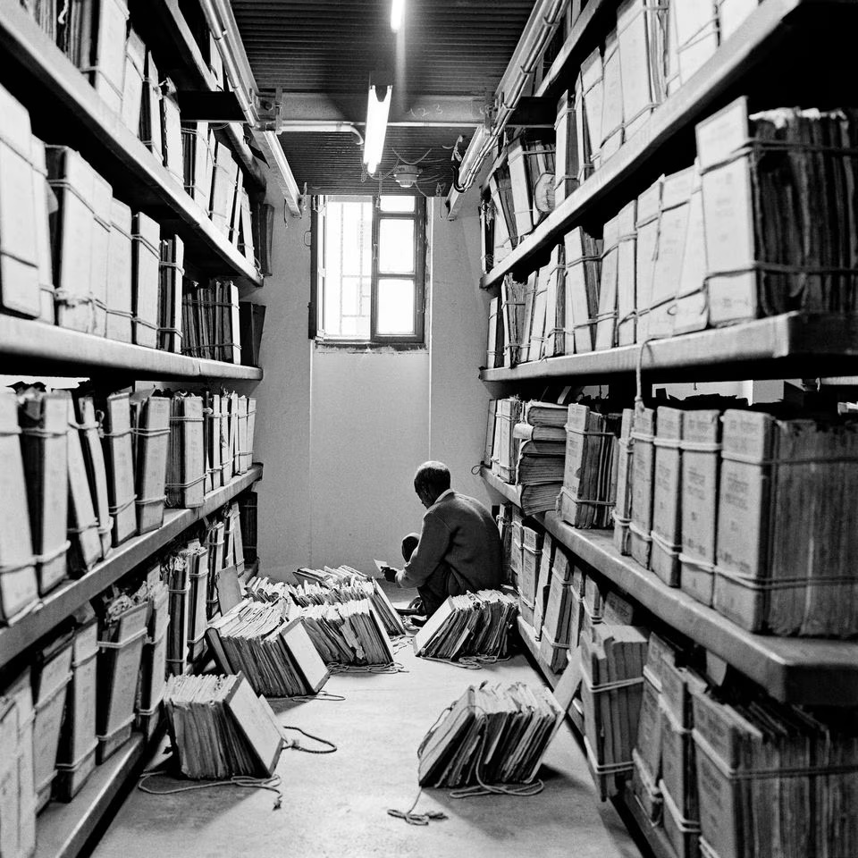

   

     On this page, we will share research outputs from the Combatting Bias project. This will include publications, templates, presentations and talks. For blog posts and updates, see <a href="../../news/resourcelist/">here</a>.
   

   

       
      <figcaption>Dayanita Singh, The File Room, 2013. © Dayanita Singh</figcaption>
   

### Talks
_Internal Publication Parade_ at the IISG 14 January 2025 – Amsterdam, NL  
_Colonial Archives and Meaningful Digital Infrastructures Symposium_ 24 January 2025 – Nijmegen, NL  
_Sector Event Bias in Erfgoedcollecties_ 14 March 2025 – Leuven, BE  
_COGLOSS x Globalise Webinar: Colonial Archives and Meaningful Digital Infrastructures_ 18 March 2025 – online  

### Events
_Combatting Bias Project Kick-Off_ 8 October 2024 (<a href="../../news/kickoffannouncement.md/">blog</a>) – Amsterdam, NL  
_Colonial Archives and Meaningful Digital Infrastructures Symposium_ 24 January 2025 (co-organised with  <a href="https://globalise.huygens.knaw.nl/">GLOBALISE</a>, <a href="https://iisg.amsterdam/en/blog/resisting-enslavement-global-historical-approach-slavery-dutch-atlantic-and-asian-empire-1620">IISG Resisting Enslavement</a>, and the <a href="https://www.ru.nl/radboud-institute-for-culture-history">Radboud Institute for Culture & History</a>) (<a href="../../news/meaningfulinfrastructuresforcolonialarchives.md/">blog</a>) – Nijmegen, NL

