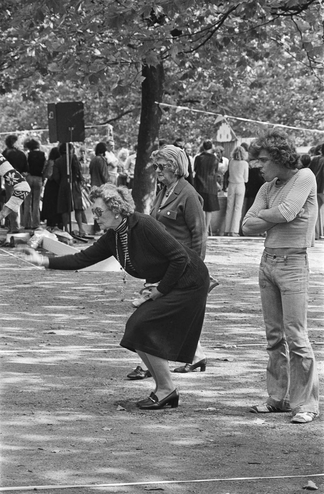

_**Please note**: this page is a work in progress_
___

To begin conceptualising bias, we first turned to its etymology. “Bias” first entered the English language in the 1570s as a technical term from the game of boules to refer to balls weighted on one side, causing them to curve obliquely. From this emerged the figurative sense of “a one-sided tendency of the mind” and later “undue propensity or prejudice,” particularly in legal contexts. The French origin biais means “sideways, askance, against the grain”—suggesting movement contrary to an expected direction.[^1] Some etymologists trace it to Latin biaxius (”with two axes”).[^2]

       
      <figcaption>Participants in action during Dutch Jeu de Boules Championship at Museumplein. Koen, Suyk, 1977, Amsterdam. Image credit: <a href="http://hdl.handle.net/10648/aca27ac4-d0b4-102d-bcf8-003048976d84">Nationaal Archief</a> </figcaption>
   

This etymology prompts a critical question: when we designate something as “biased,” what is the assumed “true” path? What constitutes an unbiased space, description, or archive—and is such a thing even possible? Rather than pursuing an illusory “bias-free” ideal, we find inspiration in another meaning of bias: in textile, bias refers to fabric’s diagonal stretch between straight grains, the warp and the weft—where the material shows greatest flexibility. Garments—such as a tie, dress, or skirt—cut “on the bias” follows this diagonal orientation, creating fluidity and adaptability in the finished piece.

[^1]: https://en.wiktionary.org/wiki/bias
[^2]: https://www.etymonline.com/word/bias

___
Definition of bias:  
**Bias** (n.) *disproportionate weight in favour of or against an idea or thing*  
___

Central to our project - and to the SSH field, we argue - is the need to scrutinise the term 'bias': **what do we mean with the concept 'bias'**?

Instead of a straight-forward definition with a straight-forward solution to the 'problem' of bias, we found that bias is often used as a heuristic, a short-hand to refer to a collection of different yet interrelated concepts, including harmful language, source selection, representation among others. In order to get to an answer to our question that is actionable and reusable, we are currently developing a 'bias taxonomy'. This taxonomy aims to provide an overview of these concepts brought together under the term 'bias', visualise their connections and their place within the lifecycle of a historical dataset. 

The taxonomy is currently in development. To get an idea of what types of concepts are affiliated with 'bias', take a look at our [Resources List](../resourcesandpublications/resources.md), in the column 'concepts used'. We invite anyone to contribute to both the list in terms of resources and/or concepts!
