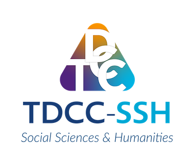
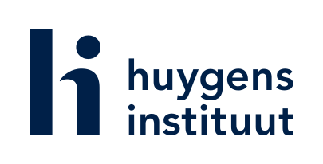

---
hide:
  - navigation
  - toc
---

# Combatting Bias

    

 <!-- The contemporary moment seems to be one of “enchanted determinism”—a constructed belief that technology will inevitably find the right answers if fed enough data. Yet the principle of “garbage in, garbage out” remains as relevant as ever. The “garbage” in this equation increasingly takes the form of bias, resulting in algorithms that discriminate against marginalised populations and systems that reproduce harmful content.

This challenge is compounded by multiple intersecting forms of bias such as in source (selection), interpretation, representation, and algorithms. Despite growing attention to ‘bias mitigation’, the term carries different meanings across disciplines, complicating systematic approaches. This conceptual instability, if left unexamined, has the tendency to render bias both omnipresent and at a risk of becoming meaningless. -->

Combatting Bias is an initiative that has created a "bias-aware framework" to support researchers in identifying, describing, and reducing harmful biases in their data. Rather than pursuing the impossible goal of complete bias elimination, this project provides guidelines for researchers to understand and transparently document biases.

1. [**Bias Vocabulary**](bias/types/about): categorisation of bias-related concepts and terminology to establish a shared vocabulary across disciplines

2. [**Bias-Aware Data Lifecycle Model**](bias/types/lifecycle/about): where and how bias emerges at different stages of dataset creation and use

The [**Bias-Aware Toolkit**](bias/toolkit) is an interface to search through the bias vocabulary and bias aware dataset lifecycle. 

<figure style="width: 100%; max-width: 100%; margin: 0;">
   
  <figcaption>Bias Map, DHBenelux, Amsterdam, 2025 </a>
</figcaption> 
</figure>

___

   
Combatting Bias is funded by the <a href="https://nwo.nl" target="_top">Dutch Research Council (NWO)</a> via the  <a href="https://tdcc.nl" target="_blank">Thematic Digital Competence Centre Social Sciences & Humanities (TDCC-SSH)</a>  
   Follow us on <a href="https://www.linkedin.com/company/combatting-bias/" target="_top">LinkedIn</a>, <a href="https://mastodon.social/@combattingbias" target="_top">Mastodon</a>, and <a href="https://bsky.app/profile/combattingbias.bsky.social" target="_top">Bluesky</a>!  
Combatting Bias is hosted at the <a href="https://www.huygens.knaw.nl" target="_top">Huygens Institute</a>.

  

        

            
        

        

            
        

    

<!-- 

   
Combatting Bias is funded by the <a href="https://nwo.nl" target="_top">Dutch Research Council (NWO)</a> via the  <a href="https://tdcc.nl" target="_blank">Thematic Digital Competence Centre Social Sciences & Humanities (TDCC-SSH)</a>
   Follow us on <a href="https://www.linkedin.com/company/combatting-bias/" target="_top">LinkedIn</a>, <a href="https://mastodon.social/@combattingbias" target="_top">Mastodon</a>, and <a href="https://bsky.app/profile/combattingbias.bsky.social" target="_top">Bluesky</a>!
Combatting Bias is hosted by the <a href="https://www.huygens.knaw.nl" target="_top">Huygens Institute</a>.
  -->
<!-- 

  

        

            
        

        

            
        

    

 -->

 

<!-- 

    

    

 -->

<!-- 

       
   

   

       
   
 -->

<!-- 

   
<em>Combatting Bias is hosted by the <a href="https://www.huygens.knaw.nl" target="_top">Huygens Institute</a>.</em>

   

       
   

 -->

    
<!-- _

   
<em>Combatting Bias is funded by the <a href="https://nwo.nl" target="_top">Dutch Research Council (NWO)</a> via the  <a href="https://tdcc.nl" target="_blank">Thematic Digital Competence Centre Social Sciences & Humanities (TDCC-SSH)</a>. </em>

   

       
   

_ -->

<!--

   

       Research within the social sciences and humanities (SSH) depends significantly on data sources, many of which perpetuate - historical biases and inequalities. <em>Combatting Bias</em> is an initiative that aims to critically examine the use of this data, as well as define sustainable, ethical and transparent standards to which future SSH data creation can adhere to. We call these standards <a href="about/fairplusprinciples/">FAIR+</a>, a combination of the FAIR principles that make data technically sound; together with +, to ensure data is ethically sound as well. We conduct this research in <a href="team/partners/partnerprojects/">collaboration</a> with four projects creating datasets from colonial archives and ten advisors from the social sciences and humanities.
   

   

       
   

   
<em>Combatting Bias is funded by the Dutch Research Council (NWO) via the Thematic Digital Competence Centre Social Sciences & Humanities (TDCC-SSH). For more information about the TDCC-SSH, please visit their website.</em>

   

<figure>
  
</figure>

<figure>
  
  <figcaption>Dayanita Singh, Museum of Chance, 2013. © Dayanita Singh</figcaption>
</figure>
--> 

